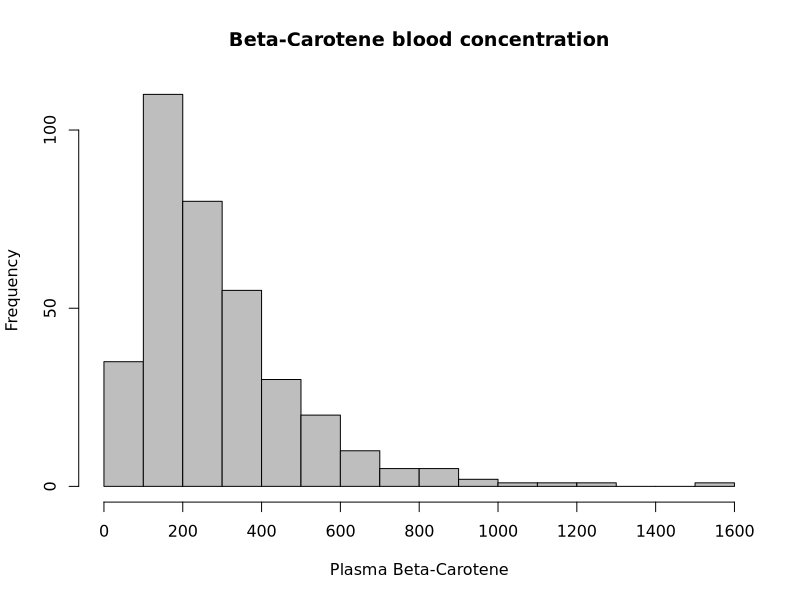

$\\$


In the following homework, you will practice analyzing quantitative data using
histograms, box plots, and z-scores. Please render this Quarto document and
submit the compiled pdf document with your answers to Gradescope
*by 11pm on Sunday September 20th*. Please also make sure to mark the correct
pages to each question's answers on Gradescope to allow the TAs to grade each
problem.


Some useful functions for completing this worksheet are: `dim()`, `length()`, 
`hist()`, `mean()`, `median()`, `max()`, `sd()`, `sum()`,  `fivenum()`, and 
`boxplot()`. Also see the "R function" page on Canvas for a list of functions we
have used in class. You might also find the following symbols useful:  $\mu$, 
$\bar{x}$, $\pi$,  $\hat{p}$. 


For all questions that involve R, please use the R chunks (gray sections) to
create relevant plots and calculations, and then answer the questions in the
"answer" section below each chunk. Be sure to "show your work" by printing out
information that answers the question that have been asked (although please do
not print out pages of irrelevant data). Also, make sure to add appropriate
labels to all plots.


If you need help with any of the homework assignments, please attend the TA
office hours which are listed on Canvas and/or ask questions on Ed Discussions
forum. Also, if you have completed the homework, please help others out by
answering questions on Ed Discussions. Finally, reviewing the class slides and
videos could be helpful if you run into difficulties.


$\\$


# Part 1:  Lock 5 questions


Please answer the following questions that are based on questions from the Lock5
textbook. Some symbols that might be useful for answering these questions
include $\hat{p}$, $\bar{x}$, $\pi$, and $\mu$. You can also write subscripts in
LaTeX by using an underscore, e.g., $\beta_{treatment}$.


$\\$


**Exercise 1.1 (6 points)**:  The plasma beta-carotene level (concentration of
beta-carotene in the blood), in ng/ml was measured for a sample of n = 315
individuals. A histogram of this sample is shown below. Please do the
following:


{width=50%, height=50%}


a. Describe the shape of this distribution using terms we have discussed in
class, and state whether there are any obvious outliers.

b. Estimate the median of this sample.

c. Estimate the mean of this sample.


Note, you might need to render the document and look at the pdf to see the image
of the beta carotene levels.


$\\$


**Answers:**  


a. 


b. 


c. 
  


$\\$


**Exercise 1.2 (6 points)**:  A set of lucky numbers are: 41, 53, 38, 32, 115,
47, and 50. For these lucky numbers, find:


a. the mean $\bar{x}$

b. the median m

c. indicate whether there appears to be any outliers, and if so, what are they?


For **this question** you **do not** need to "show your work" by including R code, 
although you are welcome to use R to get the answers. (In general, there will
be an R chunk given in the homework Quarto document for all problems where we 
expect you to show how you used R to solve a problem). 


**Answers:**  


a. 


b. 


c. 


$\\$


**Exercise 1.3 (6 points)**: Using only the whole numbers 1 through 9 as
possible data values, create a data set with n = 6, and $\bar{x}$ = 5 with:

a. The standard deviation as small as possible.

b. The standard deviation as large as possible.


Note: There can be repeated numbers in your data set (e.g., it's ok to use the
value 3 twice, etc.).


**Answers:**  

a. 

b. 


$\\$


**Exercise 1.4 (9 points)**: The number of days it took 8 different rowers to
row solo across the Atlantic Ocean is: 40, 87, 78, 106, 67, 70, 153, and 81. Use
the R chunk below to calculate the z-score for the shortest and longest row
times and interpret what these values tell us in terms of the mean and standard
deviation of the sample.

**Hint**: it will be useful to create objects that hold intermediate values before
calculating your final answers. For example, start by creating a vector called
`row_times` that has the times for the different rowers. Then create objects
called `mean_time` and `sd_time` which have the mean and standard deviations of
rowers' times. Finally, calculate the z-scores for the shortest and longest row
times.


```{r row_times}


```


**Answer:** 


$\\$


# Part 2: Analyzing quantitative data


Let's now practice analyzing data in R by examining information
about cars that were sold on [Edmunds.com](http://edmunds.com) which is a
website that helps people shop for cars. This data was used in the 2015
[DataFest](http://www.science.smith.edu/datafest/). Edmunds has made this data
available for education purposes only, so please do not distribute this data.


$\\$


**Exercise 2.1 (6 points):** The code below loads data on 5 different brands of
cars (Toyota Corollas, Subaru Imprezas, Honda Civics, Hyundai Elantras and the
Mazda 3's) in a data frame called `car_data`.

The `dim()` function in R works on a data frame and returns the number of rows and
columns in the data frame. Use the `dim()` function on the `car_data` data frame
to answer the following questions in the answer section below: 

a. How many cases are in the data frame? 

b. Report what the variables are and whether each one is categorical or quantitative.

c. Report what a (reasonable) population for this data set could be. 


Hint: to view the data frame you can load the data on the console and then use
the `View()` on the console as well. Remember that you can't use the `View()`
function in a Quarto document and also that your Quarto document does
not have access to the objects in your R environment. Instead, R can only access
objects that are created inside the Quarto document itself.


```{r num_cars}
    

# load the car data (don't change this line)
load("cars_small.Rda")


# Calculate how many rows and columns there are in the data


```


**Answers:** 

a. 

b. 


c. 


$\\$


**Exercise 2.2 (5 points)**: Let's now analyze data on Subaru Imprezas. The code 
below creates a vector called `subaru_prices`, which contains the prices for the
Subaru Imprezas that were sold. Use the `length()` function to get the sample
size *n* for the Subarus.

**Note:** the `length()` function tells you how many elements are in a *vector* 
while the `dim()` function tells you how many rows and columns are in a *data
frame*. Since we are finding the number of elements in a vector, we are using
the `length()` function here.


```{r subarus}


# This line gets a vector of only the Subaru prices (do not change it)
subaru_prices <- subset(car_data$price, car_data$brand == "Subaru")


# Calculate how many Subaru there are


```


$\\$


**Exercise 2.3 (6 points):** Now use the `mean()` and `median()` functions on the
`subaru_prices` vector. Is the mean or the median higher?  Does this indicate that the
data is left or right skewed?


```{r mean_median_price}


```


**Answer:** 


$\\$


**Exercise 2.4 (7 points):** Next use the `hist(my_vector, breaks)` function to
create a histogram of the prices for the Subarus. Try using different values for
the `breaks` argument to create different number of bins in the histogram and be
sure to label your axes appropriately. Then describe the shape of the data, and
whether there seem to be any noticeable outliers.


```{r hist_price}


```


**Answer:** 


$\\$


**Exercise 2.5 (7 points):** What proportion of Subarus sold for less than 
(or equal to) $20,000? Also, what proportion of Subarus sold for more than (or equal to) 
$25,000?  Please use the SDS1000 function `ptail(val, vector)` to get these values. 

Hint: the `lower.tail` argument might also be helpful here to answer one of these questions.


```{r}

library(SDS1000)


```


**Answer:**


$\\$


**Exercise 2.6 (7 points):** Let's now compare the Subaru prices to the prices
of Toyota Corollas and Mazda 3's. The code below creates vectors of prices called
`mazda_prices` and `toyota_prices`. Start by reporting the sample sizes for
these two types of cars. Then create side-by-side box plots to compare the prices
of these different car brands. In the answer section, in 1-4 sentences, describe
how these brands differ in their prices.


```{r compare_hists}
    

# Do not change the lines below 
mazda_prices <- subset(car_data$price, car_data$brand == "Mazda")
toyota_prices <- subset(car_data$price, car_data$brand == "Toyota")


# Add your code below...


```


**Answer:** 


$\\$


**Exercise 2.7 (7 points):** Finally, calculate the mean and median of
the prices for all three brands. Report which brand has the highest mean price
and which brand has the highest median price. Do these values match what you
would expect from looking at the box plots you created?


```{r compare_mean_sd}


```


**Answer:** 


$\\$


# Part 3: More practice analyzing quantitative data


Let's get some additional practice analyzing a single quantitative variable by
examining data on the heights of Major League Baseball (MLB) players.

We will look at all MLB players who died after 1900. The data goes up until the 
2025 baseball season. 


$\\$


**Exercise 3.1: (4 points)** The code below loads information about MLB players
into a data frame called `People`.  Please examine the data frame and answer 
the questions: 

a. What does a case correspond to in this data frame?

b. How many cases are there in the data frame? 


```{r q2_1}

# load a data frame called 'People' with baseball player information 
library(Lahman)

# A data frame with information about baseball players
People <- subset(People, deathYear > 1900 | is.na(deathYear))


```


**Answers:** 

a. 

b. 


$\\$


**Exercise 3.2 (5 points):** The code below extracts a vector of heights of all 
the baseball players in inches. Please create a histogram of their heights, and be 
sure to use an appropriate number of bins and to put appropriate labels on your
axes. Describe the shape of the histogram. Are there any noticeably small or
large outliers?


```{r q2_2}


# extract a vector with baseball player heights
player_heights <- People$height


```


**Answer:** 


$\\$


**Exercise 3.3 (8 points):** Now create a box plot of the heights, and report 
the 5 number summary. 

When you look at the box plot, you should notice that there is an extreme outlier
in the data. As we discussed in class, when you have an extreme outlier, one
of the first things you should do is to investigate what is causing the outlier, 
so please do this now and describe what you find in the answer section (Hint: 
Google could be helpful here!)


```{r q2_3}


```


**Answer:** 


$\\$


**Exercise 3.4 (6 points):** Next, calculate the mean and standard deviation of 
the heights of baseball players. Note, you will need to use the `na.rm = TRUE`
argument as well since there is missing data which we will ignore here.  

If the heights are normally distributed, what range of heights would you expect
for the middle 95% of the data to lie? Use the mean, and standard deviation to 
calculate this range (i.e., calculate the end  points of the interval that you 
would expect the middle 95% of the data to lie). Print out the values in the R 
chunk below and report the range of values in the answer section.


```{r q2_4}


```


**Answer:** 


$\\$


**Exercise 3.5 (5 points):**: Now calculate the actual actual 2.5th and
97.5th percentile values for the heights (also known as end points) where the
middle 95% of the data actually lies. Are the endpoints you calculated using the 
actual data close to those calculated under the assumption that the heights are 
normally distributed (from the previous exercise)?


```{r q2_5}


```


**Answer:** 


$\\$


**Exercise 3.6 (7 points):** Finally, calculate the z-score for the minimum value 
in the data set (again use the `na.rm = TRUE` argument when calculating the
mean, the standard deviation, and the minimum height in the data). Report what
this value is, and what this value means.


```{r q2_6}


```


**Answer:** 


$\\$


# Part 4: Calculating statistics "by hand"

In the following exercises you will calculate a few statistics "by hand" (i.e.,
without using the built in R functions).  The purpose of this exercise is to gain 
a better understanding of the mathematical notation used in class (and to become
thankful that we have computers!). As you answer these questions, we recommend you
look at the rendered pdf to see the formulas more clearly.


The data we will look at is the number from [Nathan’s Famous Hot Dog Eating
Contest](https://en.wikipedia.org/wiki/Nathan%27s_Hot_Dog_Eating_Contest) where
contestants  need to eat as many hot dogs as possible in 10 minutes. The data we
will look at is the number of hot dogs eaten by the winner of the competition in
the years 2004 to 2011, which is shown in the table below.

| Year | Hot Dogs |
|------|----------|
| 2011 |    62    |
| 2010 |    54    |
| 2009 |    68    |
| 2008 |    59    |
| 2007 |    66    |
| 2006 |    54    |
| 2005 |    49    |
| 2004 |    54    |


Note: Doctors recommend you limit the number of hot dogs you eat in a day as
discussed [here](https://www.tiktok.com/@thewhitestkidsuknow/video/7542005809690070285) and [here](https://www.tiktok.com/@paramountplusaustralia/video/7259888863781358875?lang=en).


$\\$


**Exercise 4.1 (12 points):** Calculating the standard deviation

In this first exercise you will calculate the standard deviation "by hand" by 
filling in the marked sections below. As you will recall from class, the formula
for calculating the standard deviation is:

$$s = \sqrt{\frac{1}{n-1} \sum_{i=1}^n ( x_i - \bar{x})^2}$$


Please use this formula, and the following steps, to calculate the standard
deviation for the number of hot dogs eaten by the winners. Show your work by
filling in the intermediate values in the all places where there are XXX symbols
(i.e., replace all XXX with values you calculate). All the values you fill in
should have a precision of two decimal places. You are also welcome to use R to
help with the calculations, but you must fill in the values showing all
intermediate steps everywhere there is a XXX.


## Steps for calculating the standard deviation

1. Calculate the mean number of hot dogs eaten and write your answer here: $\bar{x} = XXX$

2. Fill in column `b` in the table below showing the deviations of each data point 
from the mean, i.e., $x_i - \bar{x}$.

3. Fill in column `c` in the table below showing the squared deviations; i.e., $(x_i - \bar{x})^2$


| Num hot dogs | b. Deviations: $x_i - \bar{x}$ | c. Deviations squared: $(x_i - \bar{x})^2$ |
|--------------|---------------------------------|-----------------------------------------|
| 62           |             XXX                 |                  XXX                    |
| 54           |             XXX                 |                  XXX                    |
| 68           |             XXX                 |                  XXX                    |
| 59           |             XXX                 |                  XXX                    |
| 66           |             XXX                 |                  XXX                    |
| 54           |             XXX                 |                  XXX                    |
| 49           |             XXX                 |                  XXX                    |
| 54           |             XXX                 |                  XXX                    |


4. Write the sum of squared deviations value here:  $\sum_{i=1}^n (x_i - \bar{x})^2 = XXX$

5. Write the value of the squared deviations divided by $n-1$ here: $\frac{\sum_{i=1}^n (x_i - \bar{x})^2}{n-1} = XXX$

6. Write the value of the standard deviation, which is square root of the value you calculated in step 5: $s = XXX$


$\\$


**Exercise 4.2 (6 points):** Calculating the five-number summary 

Now please calculate the five-number summary "by hand". To do this, sort the
data from the smallest value to the largest value, and from **looking at this sorted data**, 
use the definitions for the five-number summary discussed in class, to write down 
the five-number summary in the answer section below. 

For this question, you can use R to check your work, but you should write down
the five-number summary without using any R functions, since the purpose of this 
exercise is to make sure you understand how five-number summary is calculated.

Note: As we discussed in class, there are different ways for calculating
quartiles. For this exercise, you should calculate the quartiles based on values
that are **equal to or below** a given value in your data; i.e., each
value in your five number summary (apart from  the median) should be equal to
one of the values in your original data sample.


$\\$


**Answer:** (Please write down your five-number summary below)


$\\$


## Reflection (3 points)


Please reflect on how the homework went by going to Canvas, going to the Quizzes
link, and clicking on Reflection on homework 2.


