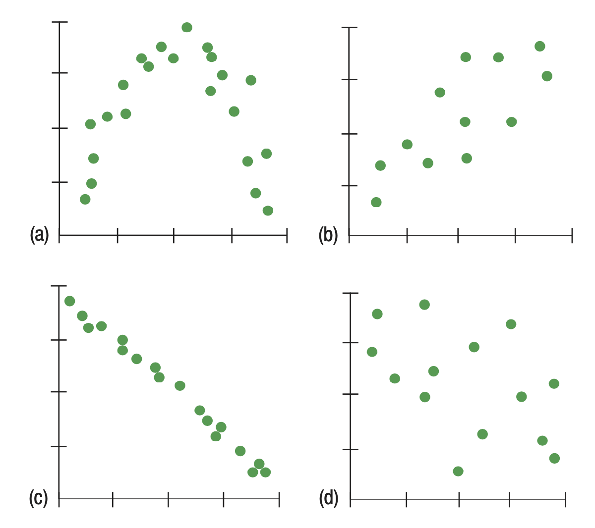

# Part 1 :  The Relationship Between Two Quantitative Variables/ Correlation 
$\\$


In this session you might use the formula of the correlation between two quantitative variables:


$$r_{x y}=\frac{1}{(n-1) s_x s_y} \sum_{ i=1}^n\left(x_i-\bar{x}\right)\left(y_i-\bar{y}\right)$$


$\\$

Remember that the fitted regression line is defined by the equation: 

* $\hat{y} = a + bx$, or 


$\\$

 You may use the following R functions: `plot()`, `lm()`, `cor()`, `abline()`. And you might need to download Lock5Data using `library(Lock5Data)`. 


$\\$

## 1.1 Describe scatterplots and correlation

Here are several scatterplots. The calculated correlations are 0.006, - 0.977, - 0.487, and 0.777. Match each scatter plot with the appropriate correlation coeffecient.


{width=55%}


$\\$


## 1.2 Create scatterplots in R 


Load the data `FloridaLakes` from library(Lock5Data).

1. Describe the type of each of the variables `pH` ,`Calcium`, and `Alkalinity`. 

2. Create a three scatter plots for each pair of the variables: `pH`  vs  `Calcium` ,`pH` vs `Alkalinity` , and  `Calcium` vs `Alkalinity` . Add the main title to each plot.

3. What is the correlation coefficient between `pH` and `Calcium`. Is it positive or negative?

4. What do these coefficients mean in the context of this data ?

5. Try to calculate the correlation coefficient between pH and Calcium without using `R` function.


```{r}
# download the data and load it into R
library(Lock5Data)
data(FloridaLakes)

```

$\\$


# Part 2: The relationship between two Quantitative Variables / Linear Regression


Remember that the fitted regression line is defined by the equation: 

* $\hat{y}=a+bx$ , or 

* $\hat{Response}= a + b ( Explanatory)$

* Residuals= observed- predicted 

Where: 

* $y$- the response (dependent) variable, the one we predict

* $x$- the explanatory (independent) variable
  
* a: is the y-intercept
  
* b: is the slope of the regression line

$\\$

You may use the following R functions: `plot()`, `lm()`, `cor()`, `abline()`, `coef()`, `predict()`, `fivenum()`. If needed, install the `Lock5Data` package once with `install.packages("Lock5Data")`, then load it with `library(Lock5Data)`.


$\\$


## 2.1 Exercise 1: State if the following sentences are true or false.

a. We choose the linear model that passes through the most data points on scatter plot.

b. The residuals are observed y-values minus the y-value predicted by linear model.

c. Least square means that the square of the largest residuals is as small as it could possibly be.

d. Some of the residuals from the least squares line will be positive and some will be negative.

e. Least squares means that some of the squares of the residuals are minimized.

f. We write $\hat{y}$ to denote the predicted values and $y$ to denote the observed values.


$\\$


## 2.2 Exercise 2:


Use data `FloridaLakes` and the two variables `Alkalinity` and `Calcium`.


1. Find the correlation for the `Alkalinity` and `Calcium`.

2. Using the appropriate R function, create a linear model to predict `Alkalinity` from `Calcium`.

3. Find the coefficients of the regression and write the correct equation of this linear model.

4. Interpret the intercept and slope of the model within the context of the data.

5. Predict the `Alkalinity` level when Calcium = 2.5.

6. The actual `Alkalinity` level was 8.5 when Calcium = 2.5. Find the residual for this data point.

7. Find the five number summary for the variable `Calcium`.

8. Predict the `Alkalinity` level when Calcium = 0.5.

9. Do both of these predictions make sense given the data?


$\\$


# Part 3: Review

## 3.1 Exercise 3:**

From the data `ICUAdmissions` create descriptive statistics (such as: `boxplot`, `histogram`, `five number summary`) for the variables `Infection`, `Age`, and `HeartRate`.

 1. Create descriptive statistics using `one quantitative variable`.
 
 2. Create descriptive statistics using `one categorical variable`.
 
 3. Descriptive statistics for `two quantitative variables`.
 
 4. Descriptive statistics for `one quantitative and one categorical variable`.
 
```{r}
# Load the Lock5Data package and the data
library(Lock5Data)
data(ICUAdmissions)


```

