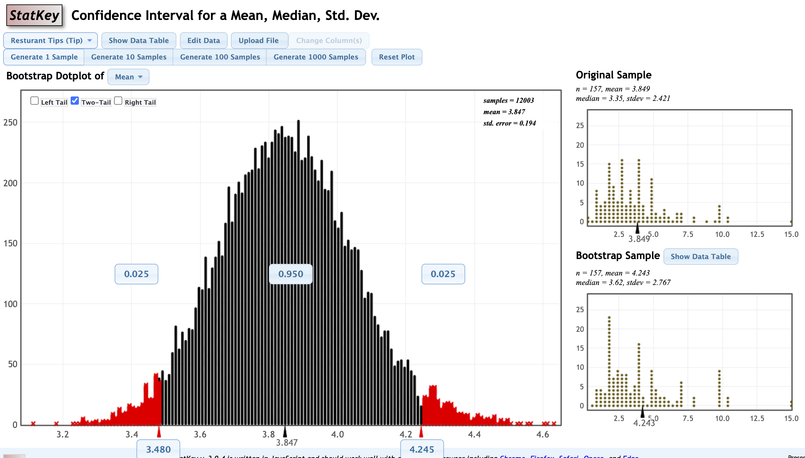

In this practice session we will introduce the bootstrap distribution and the bootstrap confidence interval. You may use the functions `sample()` and `do_it()` to generate the bootstrap distribution, and `cnorm()`  to find the critical value corresponding to a specific **confidence level**.


# Part 1: Confidence interval concept

**Practice 1:** True or False — Confidence interval interpretation

A catalog sales company promises to deliver orders placed on the Internet within 3 days. Follow-up calls to a few randomly selected customers show that a $95\%$ confidence interval for the proportion of all orders that arrive on time is $85 \% \pm 5 \%$.


1. Between $80\%$ and $90\%$ of all orders arrive on time.


2. 95% of all random samples of customers will show that $85\%$ of orders arrive on time.


3. The interval between $80\%$ and $90\%$ gives a plausible range of values for where the true population parameter lies since 95% of intervals created will contain the population proportion.


4. For a given sample size, higher confidence means a larger margin of error.


5. For a specified confidence level, smaller samples provide smaller margins of error.


**Answers:**

1. False. This statement implies certainty. There is no level of confidence in the statement.


2. False. Different samples will give different results. Many fewer than $95\%$ of samples are expected to have exactly $85\%$ on-time orders.


3. True. The interval is constructed so that, across repeated samples, 95% of such intervals would contain the true population proportion; the interval from 80% to 90% is simply one instance of that procedure.


4. True. Higher confidence requires a larger critical value, which increases the margin of error (and so widens the confidence interval) when the sample size stays the same.


5. False. Smaller samples lead to larger standard errors, which lead to larger margins of error.

$\\$


## Part 2: Construct Bootstrap Distribution 

Here’s the clever idea: We don’t have the population, but we have a sample. Probably the sample is similar to the population in many ways. So let’s sample from our sample. We’ll call it `bootstrapping`. We want samples **the same size** as our original sample, so we will need to **sample with replacement**. This means that we may pick some members of the sample more than once and others not at all. We’ll replicate this many times.


**Generating a Bootstrap Distribution:**

* Generate bootstrap samples by **sampling with replacement** from the original sample, using the **same sample size**.


* Compute the **statistic of interest** (called a bootstrap statistic), for each of the bootstrap samples.


* Collect the **sample statistics** for many bootstrap samples to create a **bootstrap distribution**.


**Example:**

Using the `StatKey` website ([link](https://www.lock5stat.com/StatKey/bootstrap_1_quant/bootstrap_1_quant.html)), try playing with the creation of the bootstrap distribution from different data. The following picture shows the website and an example of a bootstrap CI for the variable `tip` from the dataset `Restaurant tips`.

`https://www.lock5stat.com/StatKey/bootstrap_1_quant/bootstrap_1_quant.html`


{width=98%} 

$\\$


**Practice 2:**

The data `ExerciseHours` provide an in-class survey of statistics students asking them about the amount of exercise per week. 


1. **First**, create a `histogram` of `Exercise`. What is the `sample size` of the data?

```{r}
library(Lock5Data)
library(SDS1000)
data(ExerciseHours)

hours <- ExerciseHours$Exercise

hist(hours,
     main = "Histogram of Exercise Hours per Week for Stats Students",
     xlab = "Exercise Hours",
     ylab = "Frequency",
     col = "lightblue",
     border = "darkblue")

n <- length(hours)
n

```


2. **Second**, create one bootstrap sample from `Exercise`. You might use the function `sample()`.

```{r}
set.seed(5)

one_sample <- sample(hours, 
                      size = n, replace = TRUE)
```

3. **Third**, you might replicate this one sample `10000` times `with replacement` using the function `do_it()` to create a `bootstrap distribution`

```{r}

boot_dist <- do_it(10000) * {
  curr_sample <- sample(hours, size = n, replace = TRUE)
  mean(curr_sample)
}

```

4. **Fourth**, create a `histogram` for the bootstrap distribution of the variable `Exercise`

```{r}

hist(boot_dist, 
     main = "Bootstrap Distribution\nof Exercise Hours for Stats Students",
     xlab = "Estimated Mean of Exercise Hours",
     ylab = "Frequency",
     col = "deeppink",
     border = "gold2")

```

Congrats! You created a bootstrap distribution from one sample!

$\\$


## Part 3: Construct Bootstrap Confidence Interval


*Reminder:*

The steps to Construct Bootstrap Confidence Interval are: 

* 1. Compute the statistic from the original sample.


* 2. Create a bootstrap distribution by re-sampling from the sample. 

  * Same size samples as the original sample.

  * With replacement. 

  * Compute the statistic for each sample.

  * The distribution of these statistics is the bootstrap distribution.
  

* 3. Estimate the standard error SE by computing the standard deviation of the bootstrap distribution.


* 4. Create the $95\%$  CI using the formula: $statistic\pm 2*SE$. (The 2 here is a convenient rounding of the exact 95% critical value, `cnorm(0.95)` ≈ 1.96.)


* 5. Interpret the confidence interval within the context. 


$\\$


**Practice 3:**

From the `ExerciseHours` bootstrap distribution you created in the previous question, create a 95% CI for the population mean weekly exercise hours.

1. **First**, calculate the mean of `Exercise` from your original sample

```{r}

x_bar <- mean(hours)
x_bar

```


2. **Second**, create the bootstrap distribution of `Exercise`. We did it in the previous question (Practice 2). 


3. **Third**, calculate the standard error of our bootstrap distribution of `Exercise`.


```{r}

boot_se <- sd(boot_dist)
boot_se

```


4. **Fourth**, calculate the 95% CI, which is based on the formula: $statistic\pm 2*SE$

```{r}
# calculate the 95% CI

CI95_lower <- x_bar - 2 * boot_se
CI95_upper <- x_bar + 2 * boot_se

CI95_lower
CI95_upper

```

Congrats! You created a 95% CI with the bootstrap distribution!


5. **Fifth**, interpret the confidence interval within the context.

We are 95% confident that the population mean weekly exercise hours is between `r round(CI95_lower, 3)` and `r round(CI95_upper, 3)` hours.


$\\$


## Part 4: Extra Practice — Create Bootstrap Confidence Interval with Different Confidence Levels 


**Practice 4:**

*Note*: You might use the function `cnorm()` (after loading the `SDS1000` package) to help you find the critical value corresponding to a confidence level — for example, `cnorm(0.95)` returns the critical value for a 95% confidence interval.


1. Create a 90% CI of the mean `Exercise` in `R`.


```{r}

# a 90% CI of the mean Exercise

CI90_cv <- cnorm(0.9)
CI90_cv

CI90_lower_upper <- x_bar + CI90_cv * boot_se * c(-1, 1)
CI90_lower_upper


```

2. Calculate a 99% confidence interval of the mean `Exercise` using the function `cnorm()`.


```{r}

# a 99% confidence interval of the mean Exercise

CI99_cv <- cnorm(0.99)
CI99_cv

CI99_lower_upper <- x_bar + CI99_cv * boot_se * c(-1, 1)
CI99_lower_upper

```


3. Compare the three confidence intervals you have obtained from the three different confidence levels: 90%, 95%, and 99%.

As the confidence level increases from 90% to 95% to 99%, the critical value used in the margin of error gets larger, so the confidence interval gets wider — the 90% CI is the narrowest and the 99% CI is the widest, with the 95% CI in between. All three are centered at the same sample mean, `x_bar`. In this case: the 90% CI is (`r round(CI90_lower_upper[1], 3)`, `r round(CI90_lower_upper[2], 3)`), the 95% CI is (`r round(CI95_lower, 3)`, `r round(CI95_upper, 3)`), and the 99% CI is (`r round(CI99_lower_upper[1], 3)`, `r round(CI99_lower_upper[2], 3)`).

