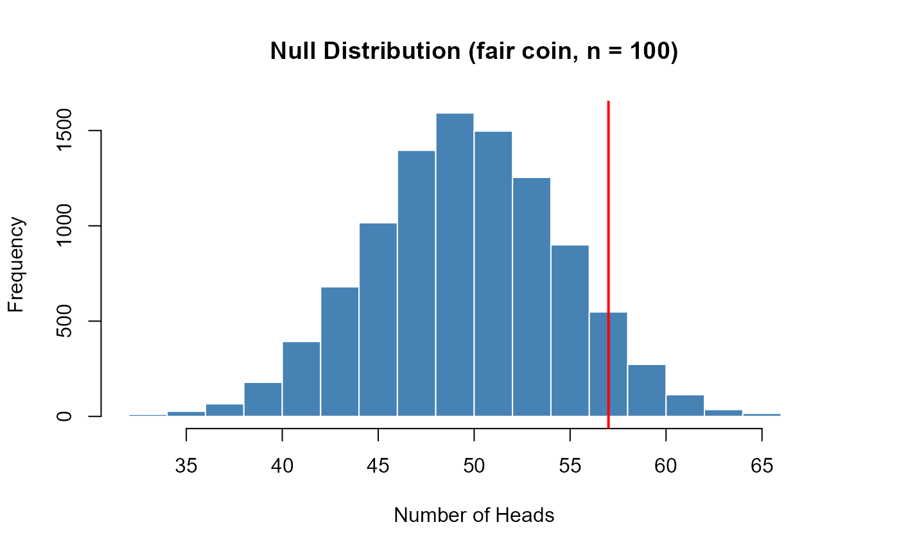
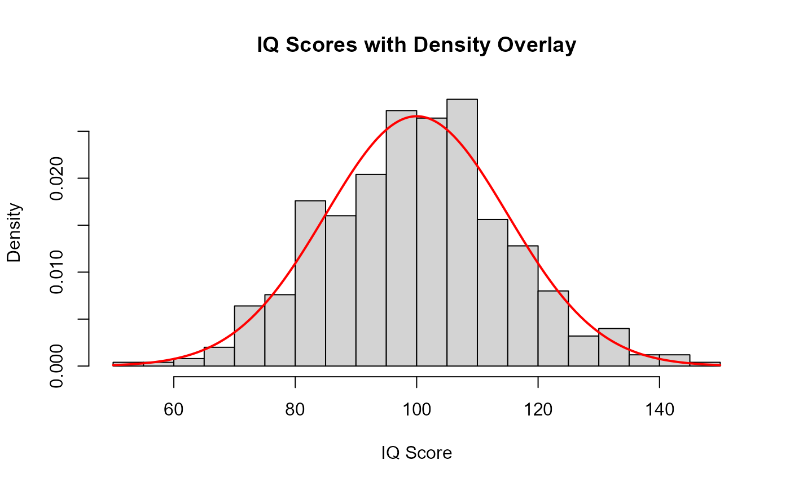
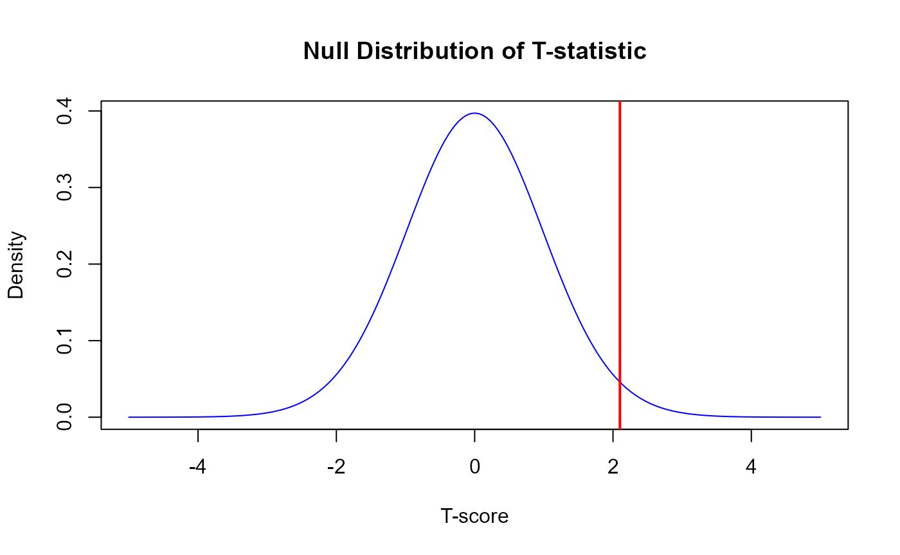
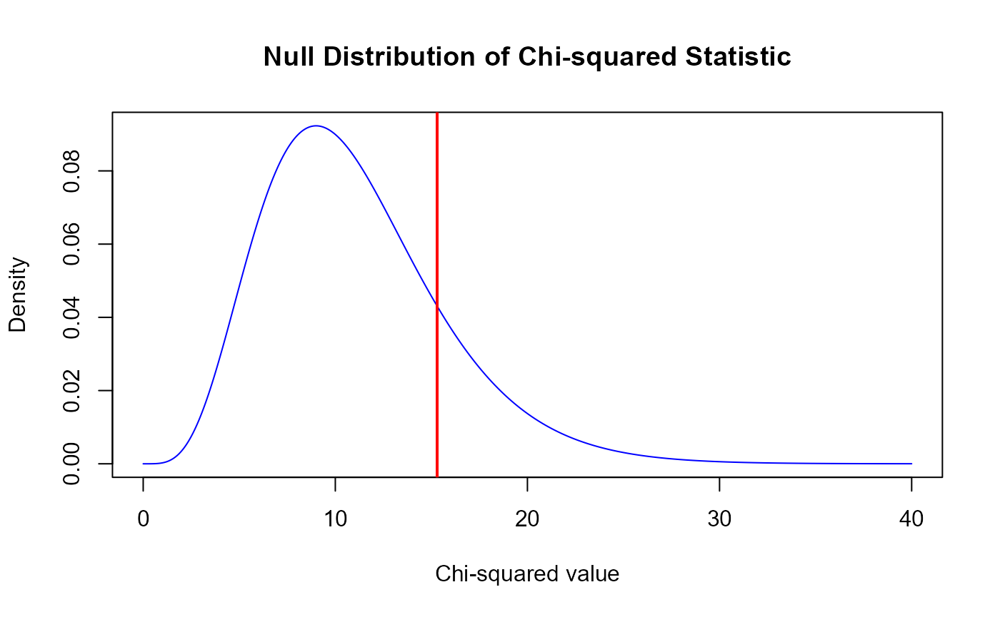
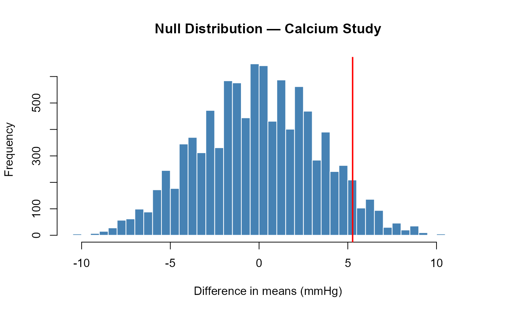
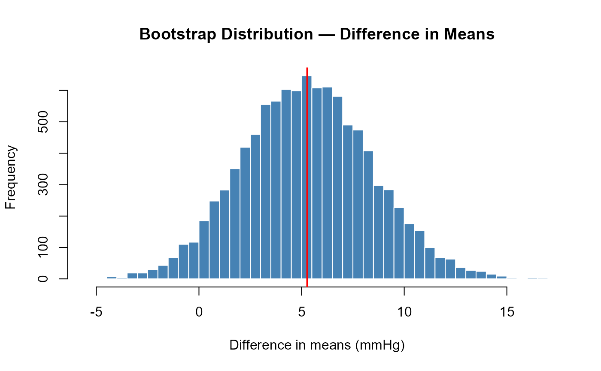

# Transitioning to Base R: Inference and Visualization

## Overview

This is **Part 2** of a two-part guide on transitioning from the SDS1000
package to base R. It covers the inference and visualization functions.
If you haven’t read Part 1, start there.

**In this article:**

- [Computing a p-value — `ptail()` →
  `mean()`](#computing-a-p-value-ptail-mean-with-a-logical-comparison)
- [Finding critical values — `cnorm()` and `ct()` → `qnorm()` and
  `qt()`](#finding-critical-values-cnorm-and-ct-qnorm-and-qt)
- [Plotting distributions — `plot_norm()` and
  friends](#plotting-distributions-plot_norm-and-friends-dnorm-and-friends)
- [Putting it all together — a complete worked
  example](#putting-it-all-together)
- [Complete cheat sheet](#complete-sds1000-base-r-cheat-sheet)

**Also in this series:**

- [Part 1: Simulation and Data
  Summaries](https://emeyers.github.io/SDS1000/articles/transitioning-simulation.md)
  — [`do_it()`](https://emeyers.github.io/SDS1000/reference/do_it.md),
  [`get_proportion()`](https://emeyers.github.io/SDS1000/reference/get_proportion.md),
  [`rflip()`](https://emeyers.github.io/SDS1000/reference/rflip.md),
  [`rroll()`](https://emeyers.github.io/SDS1000/reference/rroll.md),
  [`shuffle()`](https://emeyers.github.io/SDS1000/reference/shuffle.md),
  [`resample_pairs()`](https://emeyers.github.io/SDS1000/reference/resample_pairs.md)
- [Cheat
  Sheet](https://emeyers.github.io/SDS1000/articles/transitioning-cheatsheet.md)
  — printable one-page summary

------------------------------------------------------------------------

## Computing a p-value: `ptail()` → `mean()` with a logical comparison

### What `ptail()` does

After building a null distribution with
[`replicate()`](https://rdrr.io/r/base/lapply.html), the last step of a
hypothesis test is to compute a p-value: the proportion of values in the
null distribution that are *as extreme or more extreme* than the
observed statistic. In S&DS 1000, you used
[`ptail()`](https://emeyers.github.io/SDS1000/reference/ptail.md) for
this:

``` r

ptail(obs_value, x, lower.tail = TRUE)
```

- `obs_value` — the observed statistic from your real data
- `x` — the null distribution (a vector of simulated statistics)
- `lower.tail` — if `TRUE` (default), counts values **≤** `obs_value`
  (left tail); if `FALSE`, counts values **≥** `obs_value` (right tail)

For example, to test whether Paul the Octopus was psychic (11 correct
out of 12):

``` r

# SDS1000 version — upper-tail p-value
p_value <- ptail(paul_stat, null_distribution, lower.tail = FALSE)
```

### The base R equivalent: `mean()` with a logical comparison

[`ptail()`](https://emeyers.github.io/SDS1000/reference/ptail.md) is
just `sum(x >= obs) / length(x)` under the hood. The
[`mean()`](https://rdrr.io/r/base/mean.html) trick — taking the mean of
a logical vector — gives the same result in one step:

``` r

# Upper-tail p-value (was: ptail(obs, null, lower.tail = FALSE))
p_value <- mean(null_distribution >= obs_stat)

# Lower-tail p-value (was: ptail(obs, null, lower.tail = TRUE))
p_value <- mean(null_distribution <= obs_stat)
```

### A worked example

``` r

set.seed(4021)

obs_heads    <- 57
null_distribution <- replicate(10000, {
  rbinom(1, size = 100, prob = 0.5)
})

hist(null_distribution,
     main = "Null Distribution (fair coin, n = 100)",
     xlab = "Number of Heads",
     col = "steelblue", border = "white")
abline(v = obs_heads, col = "red", lwd = 2)
```



``` r

p_value <- mean(null_distribution >= obs_heads)
p_value
```

    ## [1] 0.0989

**Note on
[`pnull()`](https://emeyers.github.io/SDS1000/reference/pnull.md):**
Earlier homeworks used
[`pnull()`](https://emeyers.github.io/SDS1000/reference/pnull.md)
instead of
[`ptail()`](https://emeyers.github.io/SDS1000/reference/ptail.md). The
two functions are identical —
[`pnull()`](https://emeyers.github.io/SDS1000/reference/pnull.md) has
since been deprecated. Replace any
[`pnull()`](https://emeyers.github.io/SDS1000/reference/pnull.md) calls
with [`ptail()`](https://emeyers.github.io/SDS1000/reference/ptail.md),
or better yet, use [`mean()`](https://rdrr.io/r/base/mean.html)
directly.

### Quick reference

| Task | SDS1000 | Base R |
|----|----|----|
| Upper-tail p-value (obs ≥ null) | `ptail(obs, null, lower.tail = FALSE)` | `mean(null >= obs)` |
| Lower-tail p-value (obs ≤ null) | `ptail(obs, null, lower.tail = TRUE)` | `mean(null <= obs)` |

------------------------------------------------------------------------

## Finding critical values: `cnorm()` and `ct()` → `qnorm()` and `qt()`

### What these functions do

[`cnorm()`](https://emeyers.github.io/SDS1000/reference/cnorm.md) and
[`ct()`](https://emeyers.github.io/SDS1000/reference/ct.md) return the
critical value z\* or t\* needed for a confidence interval at a given
confidence level C:

``` math
CI = \bar{x} \pm z^* \cdot SE
```

### The base R equivalent: `qnorm()` and `qt()`

For confidence level C, the upper critical value is at quantile
``` math
q = 1 - \frac{1 - C}{2}
```

So a 95% CI uses the 97.5th percentile (2.5% in each tail):

``` r

# cnorm(0.95) — base R equivalent
qnorm(0.975)        # = qnorm(1 - (1 - 0.95) / 2)
```

    ## [1] 1.959964

``` r

# ct(0.95, df = 15) — base R equivalent
qt(0.975, df = 15)
```

    ## [1] 2.13145

Common critical values to know:

| Confidence level | [`qnorm()`](https://rdrr.io/r/stats/Normal.html) call | z\* |
|----|----|----|
| 90% | `qnorm(0.95)` | ≈ 1.645 |
| 95% | `qnorm(0.975)` | ≈ 1.960 |
| 99% | `qnorm(0.995)` | ≈ 2.576 |

### Using `qnorm()` and `qt()` in confidence intervals

**Bootstrap CI with normal critical value (class 11 style):**

``` r

set.seed(2251)

body_temps <- rnorm(50, mean = 98.25, sd = 0.73)
obs_mean   <- mean(body_temps)

boot_dist <- replicate(10000, mean(sample(body_temps, length(body_temps), replace = TRUE)))
SE_boot   <- sd(boot_dist)

z_star <- qnorm(0.975)             # was: cnorm(0.95)
ci_95  <- c(obs_mean - z_star * SE_boot, obs_mean + z_star * SE_boot)
ci_95
```

    ## [1] 98.06333 98.51613

**Theory-based t CI (class 21 style):**

``` r

n    <- 55;  xbar <- 7.0;  s <- 1.2
SE   <- s / sqrt(n);  df <- n - 1

t_star <- qt(0.975, df = df)       # was: ct(0.95, df)
ci     <- c(xbar - t_star * SE, xbar + t_star * SE)
ci
```

    ## [1] 6.675595 7.324405

### Quick reference

| Task | SDS1000 | Base R |
|----|----|----|
| Normal critical value for C% CI | `cnorm(C)` | `qnorm(1 - (1 - C) / 2)` |
| t critical value for C% CI | `ct(C, df)` | `qt(1 - (1 - C) / 2, df = df)` |
| Both critical values (±) | `cnorm(C, side = "both")` | `c(qnorm((1-C)/2), qnorm(1-(1-C)/2))` |

------------------------------------------------------------------------

## Plotting distributions: `plot_norm()` and friends → `dnorm()` and friends

In base R, theoretical distributions are plotted using three steps:
create x values with [`seq()`](https://rdrr.io/r/base/seq.html),
evaluate the density function, then call
[`plot()`](https://rdrr.io/r/graphics/plot.default.html) with
`type = "l"`. The class code uses this pattern from class 19 onwards.

**The general pattern:**

``` r

x    <- seq(lower, upper, length.out = 1000)
dens <- d___(x, ...)
plot(x, dens, type = "l",
     main = "...", xlab = "...", ylab = "Density")
abline(v = obs_stat, col = "red", lwd = 2)   # mark the observed statistic
```

### Normal distribution (`plot_norm()` → `dnorm()`)

From class 19 — the distribution of IQ scores:

``` r

x    <- seq(50, 150, length.out = 1000)
dens <- dnorm(x, mean = 100, sd = 15)

plot(x, dens, type = "l",
     main = "Distribution of IQ Scores",
     xlab = "IQ Score", ylab = "Density")
```


To overlay a density curve on a histogram, use `probability = TRUE` in
[`hist()`](https://rdrr.io/r/graphics/hist.html) and then
[`lines()`](https://rdrr.io/r/graphics/lines.html):

``` r

iq_scores <- rnorm(500, mean = 100, sd = 15)

hist(iq_scores, probability = TRUE, breaks = 30,
     main = "IQ Scores with Density Overlay", xlab = "IQ Score")
lines(x, dens, col = "red", lwd = 2)
```



### t-distribution (`plot_t()` → `dt()`)

From class 21 and 22 — marking an observed t-statistic:

``` r

df <- 54;  t_stat <- 2.1

x    <- seq(-5, 5, length.out = 1000)
dens <- dt(x, df = df)

plot(x, dens, type = "l", col = "blue",
     main = "Null Distribution of T-statistic",
     xlab = "T-score", ylab = "Density")
abline(v = t_stat, col = "red", lwd = 2)
```



``` r

pt(t_stat, df = df, lower.tail = FALSE)   # p-value
```

    ## [1] 0.02020777

### Chi-squared distribution (`plot_chisq()` → `dchisq()`)

From class 23 and 24:

``` r

df <- 11;  chi_sq_stat <- 15.3

x    <- seq(0, 40, length.out = 1000)
dens <- dchisq(x, df = df)

plot(x, dens, type = "l", col = "blue",
     main = "Null Distribution of Chi-squared Statistic",
     xlab = "Chi-squared value", ylab = "Density")
abline(v = chi_sq_stat, col = "red", lwd = 2)
```



``` r

pchisq(chi_sq_stat, df = df, lower.tail = FALSE)   # p-value
```

    ## [1] 0.1691706

### Quick reference

| Distribution | Density function | p-value function | SDS1000 plot |
|----|----|----|----|
| Normal | `dnorm(x, mean, sd)` | [`pnorm()`](https://rdrr.io/r/stats/Normal.html) | [`plot_norm()`](https://emeyers.github.io/SDS1000/reference/plot_norm.md) |
| t | `dt(x, df)` | [`pt()`](https://rdrr.io/r/stats/TDist.html) | [`plot_t()`](https://emeyers.github.io/SDS1000/reference/plot_t.md) |
| Chi-squared | `dchisq(x, df)` | [`pchisq()`](https://rdrr.io/r/stats/Chisquare.html) | [`plot_chisq()`](https://emeyers.github.io/SDS1000/reference/plot_chisq.md) |
| F | `df(x, df1, df2)` | [`pf()`](https://rdrr.io/r/stats/Fdist.html) | [`plot_f()`](https://emeyers.github.io/SDS1000/reference/plot_f.md) |

------------------------------------------------------------------------

## Putting it all together

A complete, base-R-only analysis using the **calcium supplement study**
from the class 17 notes. Lyle et al. (1987) randomly assigned men to a
treatment group (calcium supplement, n = 10) or a control group
(placebo, n = 11) for 12 weeks. The outcome is the decrease in blood
pressure.

### Step 1: Data and observed statistic

``` r

treat   <- c(7, -4, 18, 17, -3, -5,  1, 10, 11, -2)
control <- c(-1, 12, -1, -3,  3, -5,  5,  2, -11, -1, -3)

obs_stat <- mean(treat) - mean(control)
obs_stat
```

    ## [1] 5.272727

### Step 2: Permutation test

``` math
H_0: \mu_\text{treat} = \mu_\text{control} \qquad H_A: \mu_\text{treat} > \mu_\text{control}
```

| SDS1000                                | Base R                      |
|----------------------------------------|-----------------------------|
| `do_it(10000) * { ... }`               | `replicate(10000, { ... })` |
| `shuffle(combined_data)`               | `sample(combined_data)`     |
| `pnull(obs, null, lower.tail = FALSE)` | `mean(null >= obs)`         |

``` r

set.seed(6174)
combined_data <- c(treat, control)

null_dist <- replicate(10000, {
  shuff         <- sample(combined_data)
  mean(shuff[1:10]) - mean(shuff[11:21])
})

hist(null_dist, breaks = 60,
     main = "Null Distribution — Calcium Study",
     xlab = "Difference in means (mmHg)",
     col = "steelblue", border = "white")
abline(v = obs_stat, col = "red", lwd = 2)
```



``` r

p_value <- mean(null_dist >= obs_stat)
p_value
```

    ## [1] 0.0605

The p-value is just above 0.05: suggestive, but not conclusive at α =
0.05.

### Step 3: Bootstrap confidence interval

| SDS1000                  | Base R                      |
|--------------------------|-----------------------------|
| `do_it(10000) * { ... }` | `replicate(10000, { ... })` |
| `cnorm(0.95)`            | `qnorm(0.975)`              |

``` r

set.seed(6174)

boot_dist <- replicate(10000, {
  mean(sample(treat,   replace = TRUE)) -
  mean(sample(control, replace = TRUE))
})

hist(boot_dist, breaks = 60,
     main = "Bootstrap Distribution — Difference in Means",
     xlab = "Difference in means (mmHg)",
     col = "steelblue", border = "white")
abline(v = obs_stat, col = "red", lwd = 2)
```



**Method 1 — SE-based CI** (uses
[`qnorm()`](https://rdrr.io/r/stats/Normal.html), as in class 11):

``` r

SE_boot <- sd(boot_dist)
z_star  <- qnorm(0.975)               # was: cnorm(0.95)
ci_se   <- c(obs_stat - z_star * SE_boot,
             obs_stat + z_star * SE_boot)
ci_se
```

    ## [1] -0.8691632 11.4146178

**Method 2 — Percentile CI** (no normality assumption):

``` r

ci_pct <- quantile(boot_dist, c(0.025, 0.975))
ci_pct
```

    ##       2.5%      97.5% 
    ## -0.6636364 11.5181818

Both intervals include zero, consistent with the hypothesis test, but
extend well above zero — a meaningful treatment effect remains
plausible.

------------------------------------------------------------------------

## Complete SDS1000 → Base R cheat sheet

All substitutions covered across both parts of this guide. See also the
[printable cheat
sheet](https://emeyers.github.io/SDS1000/articles/transitioning-cheatsheet.md).

| Task | SDS1000 | Base R |
|----|----|----|
| Repeat a process *n* times | `do_it(n) * { expr }` | `replicate(n, { expr })` |
| Proportion of one category | `get_proportion(v, "cat")` | `mean(v == "cat")` |
| Proportions of all categories | — | `prop.table(table(v))` |
| Randomly permute a vector | `shuffle(v)` | `sample(v)` |
| Upper-tail p-value | `ptail(obs, null, lower.tail = FALSE)` | `mean(null >= obs)` |
| Lower-tail p-value | `ptail(obs, null, lower.tail = TRUE)` | `mean(null <= obs)` |
| Bootstrap resample (paired) | `resample_pairs(v1, v2)` | `idx <- sample(n, replace=TRUE); v1[idx]; v2[idx]` |
| Bootstrap resample (independent) | — | `sample(v, length(v), replace = TRUE)` |
| Normal critical value for C% CI | `cnorm(C)` | `qnorm(1 - (1 - C) / 2)` |
| t critical value for C% CI | `ct(C, df)` | `qt(1 - (1 - C) / 2, df = df)` |
| Count of heads from *n* flips | `rflip(n, prob)` | `rbinom(1, size = n, prob = prob)` |
| Counts for each die face | `rroll(n, prob)` | `as.vector(rmultinom(1, size = n, prob = prob))` |
| Plot a normal density curve | `plot_norm(mean, sd)` | `plot(x, dnorm(x, mean, sd), type = "l")` |
| Plot a t density curve | `plot_t(df)` | `plot(x, dt(x, df), type = "l")` |
| Plot a chi-squared density curve | `plot_chisq(df)` | `plot(x, dchisq(x, df), type = "l")` |
