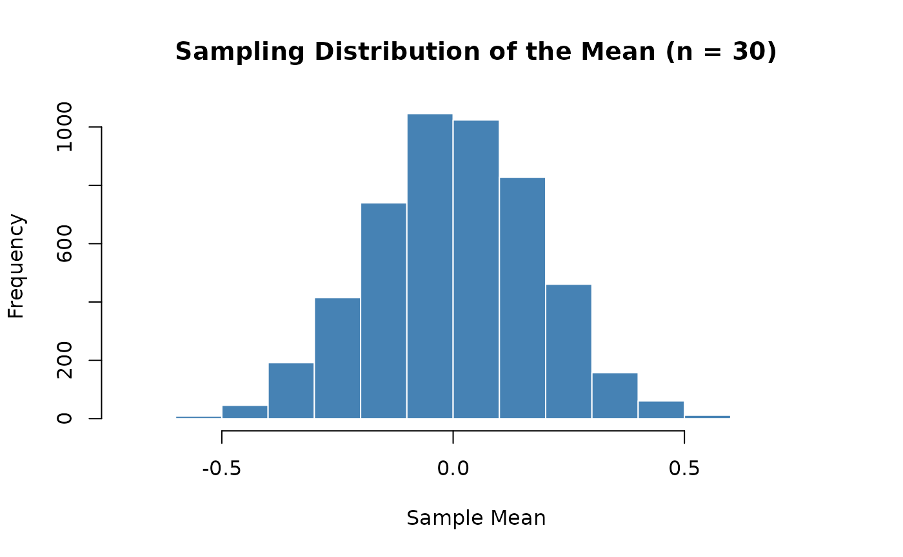
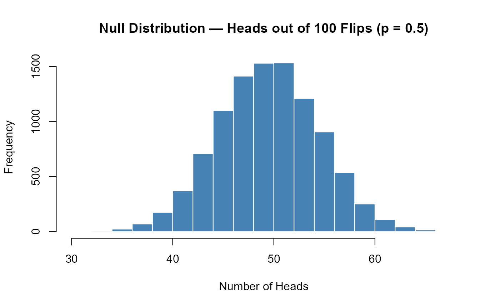
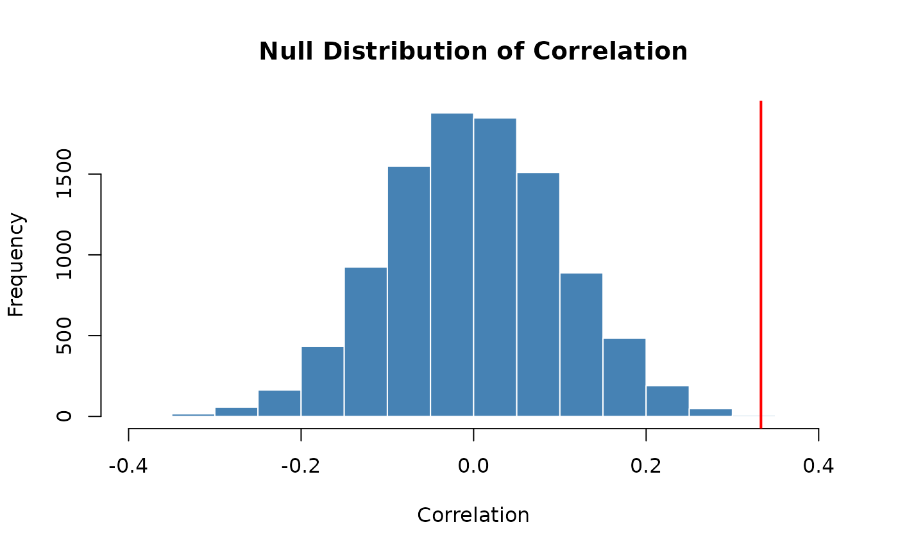

# Transitioning to Base R: Simulation and Data Summaries

## Overview

The SDS1000 package was designed to make it easier to learn the core
ideas of statistics in R. Now that you have finished S&DS 1000, you are
ready to analyze data using standard R tools that are available to every
R user — no special package required.

This is **Part 1** of a two-part guide. It covers the simulation and
data summary functions. Part 2 covers inference and visualization.

**In this article:**

- [Repeating a process — `do_it()` →
  `replicate()`](#repeating-a-process-do_it-replicate)
- [Calculating a proportion — `get_proportion()` → `mean()` or
  `table()`](#calculating-a-proportion-get_proportion-mean-or-table)
- [Simulating coin flips and die rolls — `rflip()` and
  `rroll()`](#simulating-coin-flips-and-die-rolls-rflip-and-rroll)
- [Permutation tests and bootstrapping — `shuffle()` and
  `resample_pairs()`](#permutation-tests-and-bootstrapping-shuffle-and-resample_pairs)

**Also in this series:**

- [Part 2: Inference and
  Visualization](https://emeyers.github.io/SDS1000/articles/transitioning-inference.md)
  — [`ptail()`](https://emeyers.github.io/SDS1000/reference/ptail.md),
  [`cnorm()`](https://emeyers.github.io/SDS1000/reference/cnorm.md),
  [`ct()`](https://emeyers.github.io/SDS1000/reference/ct.md),
  distribution plots, and a complete worked example
- [Parametric Hypothesis
  Tests](https://emeyers.github.io/SDS1000/articles/class-summary-parametric-tests.md)
  — t-tests, chi-squared, ANOVA, correlation, and regression
- [Cheat
  Sheet](https://emeyers.github.io/SDS1000/articles/transitioning-cheatsheet.md)
  — printable one-page summary

------------------------------------------------------------------------

## Repeating a process: `do_it()` → `replicate()`

### What `do_it()` does

In S&DS 1000, you used `do_it(n)` to repeat a block of code `n` times
and collect the results into a vector. For example, to build a
**sampling distribution** of the proportion of red sprinkles from
samples of size 100:

``` r

# SDS1000 version
sampling_distribution <- do_it(10000) * {
  get_proportion(rsprinkles(100), "red")
}
```

You also used it to build a **bootstrap distribution**:

``` r

# SDS1000 version
bootstrap_dist <- do_it(10000) * {
  mean(sample(price_sample, length(price_sample), replace = TRUE))
}
```

And to build a **null distribution** by shuffling:

``` r

# SDS1000 version
null_distribution <- do_it(10000) * {
  cor(shuffle(draft_numbers), birth_months)
}
```

### The base R equivalent: `replicate()`

The base R function `replicate(n, expr)` does exactly the same thing: it
evaluates the expression `expr` a total of `n` times and returns the
results as a vector.

``` r

results <- replicate(n, {
  # your code here — the result of the last line is collected
})
```

Here are the same three examples rewritten with
[`replicate()`](https://rdrr.io/r/base/lapply.html):

**Sampling distribution:**

``` r

sampling_distribution <- replicate(10000, {
  mean(rsprinkles(100) == "red")   # get_proportion() → mean(v == "cat")
})
```

**Bootstrap distribution:**

``` r

bootstrap_dist <- replicate(10000, {
  mean(sample(price_sample, length(price_sample), replace = TRUE))
})
```

**Null distribution (shuffling):**

``` r

null_distribution <- replicate(10000, {
  cor(sample(draft_numbers), birth_months)  # sample() with no replace = shuffles
})
```

### The `for` loop alternative

You can also use a `for` loop, which makes the mechanics more explicit:

``` r

n_repetitions <- 10000
sampling_distribution <- numeric(n_repetitions)  # pre-allocate an empty vector

for (i in 1:n_repetitions) {
  sampling_distribution[i] <- mean(rsprinkles(100) == "red")
}
```

The [`replicate()`](https://rdrr.io/r/base/lapply.html) approach is more
concise; the `for` loop makes the indexing transparent. Both produce
identical results.

### A working example

``` r

set.seed(1783)

sampling_dist <- replicate(5000, {
  mean(rnorm(30, mean = 0, sd = 1))
})

hist(sampling_dist,
     main = "Sampling Distribution of the Mean (n = 30)",
     xlab = "Sample Mean",
     col = "steelblue", border = "white")
```



### Quick reference

| Task | SDS1000 | Base R |
|----|----|----|
| Repeat a process `n` times | `do_it(n) * { expr }` | `replicate(n, { expr })` |
| Repeat with explicit indexing | — | `for (i in 1:n) { result[i] <- expr }` |

------------------------------------------------------------------------

## Calculating a proportion: `get_proportion()` → `mean()` or `table()`

### What `get_proportion()` does

`get_proportion(v, category_name)` returns the proportion of elements in
vector `v` that belong to a named category:

``` r

# SDS1000 version
p_hat <- get_proportion(one_sample, "red")
```

### Base R approach 1: `mean()` with a logical comparison (recommended)

Because `TRUE` and `FALSE` are stored as `1` and `0` in R, taking
[`mean()`](https://rdrr.io/r/base/mean.html) of a logical vector gives
the proportion of `TRUE` values:

``` r

p_hat <- mean(one_sample == "red")
```

This form is especially useful inside
[`replicate()`](https://rdrr.io/r/base/lapply.html) since it fits on one
line:

``` r

sampling_distribution <- replicate(10000, {
  mean(rsprinkles(100) == "red")
})
```

### Base R approach 2: `table()` and `prop.table()`

Use these when you want to see all categories at once:

``` r

one_sample <- rsprinkles(100)
table(one_sample)         # raw counts
```

    ## one_sample
    ##  green orange   pink    red  white yellow 
    ##     11     13     11     16     29     20

``` r

prop.table(table(one_sample))   # proportions for every category
```

    ## one_sample
    ##  green orange   pink    red  white yellow 
    ##   0.11   0.13   0.11   0.16   0.29   0.20

### Quick reference

| Task | SDS1000 | Base R |
|----|----|----|
| Proportion of one category | `get_proportion(v, "red")` | `mean(v == "red")` |
| Proportions of all categories | — | `prop.table(table(v))` |
| Counts of all categories | — | `table(v)` |

------------------------------------------------------------------------

## Simulating coin flips and die rolls: `rflip()` and `rroll()`

### `rflip()` → `rbinom()`

`rflip(num_flips, prob)` simulates flipping a coin `num_flips` times and
returns the **count** of heads. Under the hood it is one call to
[`rbinom()`](https://rdrr.io/r/stats/Binomial.html):

``` r

rflip(num_flips, prob)
rbinom(1, size = num_flips, prob = prob)   # equivalent
```

Simulating 100 fair coin flips (class 12 / 13 style):

``` r

set.seed(3341)
rbinom(1, size = 100, prob = 0.5)
```

    ## [1] 56

To build a null distribution of head counts inside
[`replicate()`](https://rdrr.io/r/base/lapply.html):

``` r

set.seed(7823)

null_dist <- replicate(10000, rbinom(1, size = 100, prob = 0.5))

hist(null_dist,
     main = "Null Distribution — Heads out of 100 Flips (p = 0.5)",
     xlab = "Number of Heads",
     col = "steelblue", border = "white")
```



To return a **proportion** instead of a count, divide by `num_flips`:

``` r

# rflip(48, prob = 0.6) / 48    ← SDS1000
rbinom(1, size = 48, prob = 0.6) / 48   # Base R
```

### `rroll()` → `rmultinom()`

`rroll(num_rolls, prob)` simulates rolling a die `num_rolls` times and
returns the **count** of each face. It wraps
[`rmultinom()`](https://rdrr.io/r/stats/Multinom.html):

``` r

rroll(100)                                                    # SDS1000
as.vector(rmultinom(1, size = 100, prob = rep(1/6, 6)))      # Base R
```

[`rmultinom()`](https://rdrr.io/r/stats/Multinom.html) returns a matrix,
so [`as.vector()`](https://rdrr.io/r/base/vector.html) is needed for a
plain vector. For a 12-sided die as used in class 23:

``` r

set.seed(3319)
die_counts <- as.vector(rmultinom(1, size = 120, prob = rep(1/12, 12)))
names(die_counts) <- 1:12
die_counts
```

    ##  1  2  3  4  5  6  7  8  9 10 11 12 
    ##  9  9 15  8  9  8  7 15  9  8 15  8

### Quick reference

| Task | SDS1000 | Base R |
|----|----|----|
| Count of heads from *n* flips | `rflip(n, prob)` | `rbinom(1, size = n, prob = prob)` |
| Proportion of heads from *n* flips | `rflip(n, prob) / n` | `rbinom(1, n, prob) / n` |
| Counts for each face of a die | `rroll(n, prob)` | `as.vector(rmultinom(1, size = n, prob = prob))` |

------------------------------------------------------------------------

## Permutation tests and bootstrapping: `shuffle()` and `resample_pairs()`

These two functions are the building blocks of simulation-based
inference.
[`shuffle()`](https://emeyers.github.io/SDS1000/reference/shuffle.md)
powers **permutation tests**;
[`resample_pairs()`](https://emeyers.github.io/SDS1000/reference/resample_pairs.md)
powers **bootstrap confidence intervals** for paired variables.

### `shuffle()` → `sample()`

`shuffle(v)` is a direct wrapper around `sample(v)` — both return a
random permutation of `v`:

``` r

shuffle(v)   # SDS1000
sample(v)    # Base R — identical
```

In a permutation test, shuffling one variable breaks its relationship
with another, simulating the null hypothesis. For example, testing
whether draft numbers were correlated with birth date:

``` r

set.seed(8812)

n <- 100
x <- rnorm(n)
y <- 0.3 * x + rnorm(n)
obs_stat <- cor(x, y)

null_distribution <- replicate(10000, {
  cor(sample(x), y)   # sample(x) = shuffle(x)
})

p_value <- mean(abs(null_distribution) >= abs(obs_stat))

hist(null_distribution,
     main = "Null Distribution of Correlation",
     xlab = "Correlation", col = "steelblue", border = "white")
abline(v = obs_stat, col = "red", lwd = 2)
```



``` r

p_value
```

    ## [1] 8e-04

### `resample_pairs()` → `sample()` with `replace = TRUE`

`resample_pairs(vector1, vector2)` draws a bootstrap resample from two
paired vectors, keeping each pair together. The key is generating one
set of indices and applying them to both vectors:

``` r

# SDS1000 version
resampled_data   <- resample_pairs(cigs_per_capita, cancer_rate)
resampled_cigs   <- resampled_data$vector1
resampled_cancer <- resampled_data$vector2

# Base R version
n                <- length(cigs_per_capita)
boot_inds        <- sample(n, replace = TRUE)
resampled_cigs   <- cigs_per_capita[boot_inds]
resampled_cancer <- cancer_rate[boot_inds]
```

A complete bootstrap for a regression slope in base R (class 25 style):

``` r

set.seed(3047)

cigs_per_capita <- runif(50, 10, 40)
cancer_rate     <- 2 + 0.8 * cigs_per_capita + rnorm(50, sd = 5)
obs_slope       <- coef(lm(cancer_rate ~ cigs_per_capita))[2]

boot_dist <- replicate(10000, {
  n         <- length(cigs_per_capita)
  boot_inds <- sample(n, replace = TRUE)
  coef(lm(cancer_rate[boot_inds] ~ cigs_per_capita[boot_inds]))[2]
})

hist(boot_dist,
     main = "Bootstrap Distribution of Regression Slope",
     xlab = "Slope", col = "steelblue", border = "white")
abline(v = obs_slope, col = "red", lwd = 2)
```


``` r

quantile(boot_dist, c(0.025, 0.975))
```

    ##      2.5%     97.5% 
    ## 0.7284031 0.9983307

### Quick reference

| Task | SDS1000 | Base R |
|----|----|----|
| Randomly permute a vector | `shuffle(v)` | `sample(v)` |
| Bootstrap resample two paired vectors | `resample_pairs(v1, v2)` | `idx <- sample(n, replace=TRUE); v1[idx]; v2[idx]` |

**Continue to Part 2:** [Inference and
Visualization](https://emeyers.github.io/SDS1000/articles/transitioning-inference.md)
covers
[`ptail()`](https://emeyers.github.io/SDS1000/reference/ptail.md),
[`cnorm()`](https://emeyers.github.io/SDS1000/reference/cnorm.md),
[`ct()`](https://emeyers.github.io/SDS1000/reference/ct.md),
distribution plots, and a complete worked example tying everything
together.
