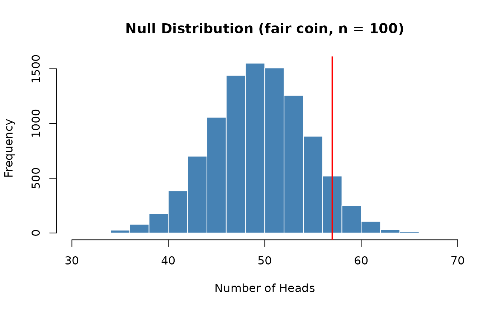
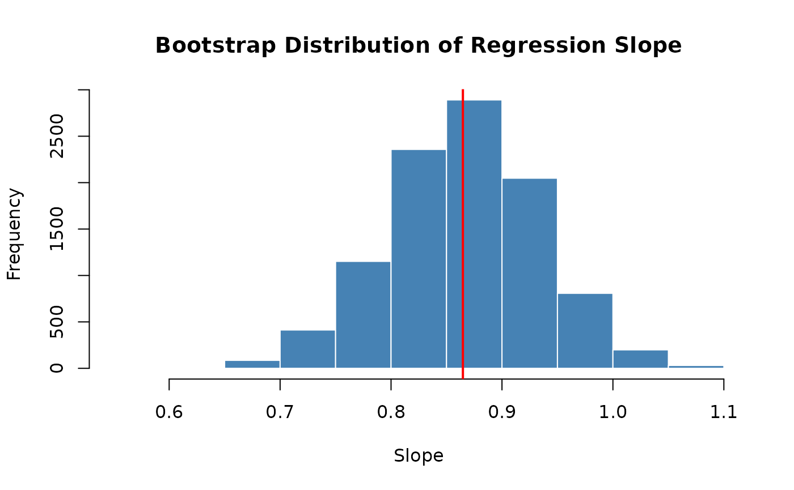
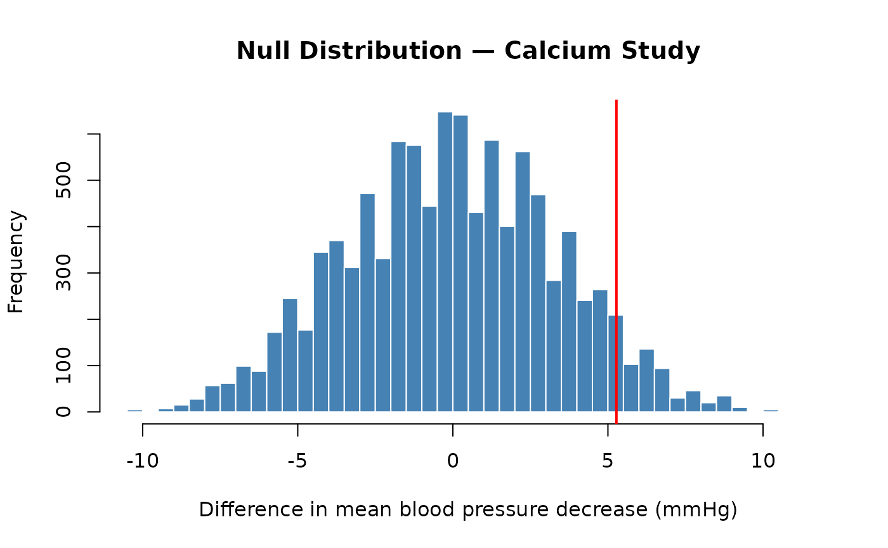
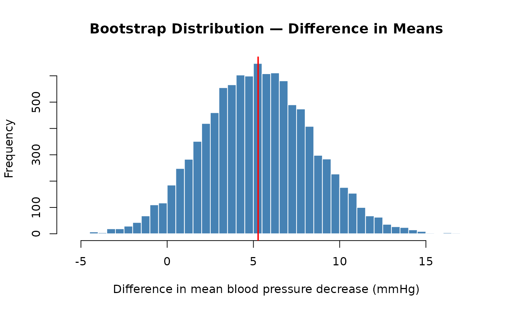

# Transitioning from SDS1000 to Base R

## Overview

The SDS1000 package was designed to make it easier to learn the core
ideas of statistics in R. Now that you have finished S&DS 1000, you are
ready to analyze data using standard R tools that are available to every
R user — no special package required.

This guide walks through the SDS1000 functions you used most often and
shows you the equivalent base R code. In most cases the base R version
is only slightly more verbose, and understanding it will make you a more
capable and independent programmer.

------------------------------------------------------------------------

## Repeating a process: `do_it()` → `replicate()`

### What `do_it()` does

In S&DS 1000, you used `do_it(n)` to repeat a block of code `n` times
and collect the results into a vector. For example, to build a
**sampling distribution** of the proportion of red sprinkles from
samples of size 100:

``` r

# SDS1000 version
sampling_distribution <- do_it(10000) * {
  get_proportion(rsprinkles(100), "red")
}
```

You also used it to build a **bootstrap distribution**:

``` r

# SDS1000 version
bootstrap_dist <- do_it(10000) * {
  mean(sample(price_sample, length(price_sample), replace = TRUE))
}
```

And to build a **null distribution** by shuffling:

``` r

# SDS1000 version
null_distribution <- do_it(10000) * {
  cor(shuffle(draft_numbers), birth_months)
}
```

### The base R equivalent: `replicate()`

The base R function `replicate(n, expr)` does exactly the same thing: it
evaluates the expression `expr` a total of `n` times and returns the
results as a vector.

The pattern is:

``` r

results <- replicate(n, {
  # your code here — the result of the last line is collected
})
```

Here are the same three examples rewritten with
[`replicate()`](https://rdrr.io/r/base/lapply.html):

**Sampling distribution:**

``` r

# Base R version
sampling_distribution <- replicate(10000, {
  get_proportion(rsprinkles(100), "red")
})
```

**Bootstrap distribution:**

``` r

# Base R version
bootstrap_dist <- replicate(10000, {
  mean(sample(price_sample, length(price_sample), replace = TRUE))
})
```

**Null distribution (shuffling):**

``` r

# Base R version
null_distribution <- replicate(10000, {
  cor(sample(draft_numbers), birth_months)  # sample() with no replace argument shuffles
})
```

Note: in the null distribution example,
[`shuffle()`](https://emeyers.github.io/SDS1000/reference/shuffle.md)
from SDS1000 is replaced by
[`sample()`](https://rdrr.io/r/base/sample.html) with no additional
arguments. Calling `sample(x)` on a vector `x` returns a random
permutation of its elements — which is exactly what a shuffle does.

### The `for` loop alternative

You can also use a `for` loop, which is more explicit and easier to read
when you are first learning:

``` r

# Base R version using a for loop
n_repetitions <- 10000
sampling_distribution <- numeric(n_repetitions)  # create an empty vector to fill

for (i in 1:n_repetitions) {
  sampling_distribution[i] <- get_proportion(rsprinkles(100), "red")
}
```

The steps are:

1.  Decide how many times to repeat (`n_repetitions`).
2.  Create an empty vector of that length with
    [`numeric()`](https://rdrr.io/r/base/numeric.html) to store results.
3.  Loop from `1` to `n_repetitions`, computing a result each time and
    storing it in position `i` of the vector.

The [`replicate()`](https://rdrr.io/r/base/lapply.html) approach is more
concise; the `for` loop makes the mechanics more transparent. Both
produce identical results.

### A working example

Here is a complete, self-contained example you can run right now. It
builds a sampling distribution of the mean of 30 random normal values,
entirely in base R:

``` r

set.seed(1783)

sampling_dist <- replicate(5000, {
  mean(rnorm(30, mean = 0, sd = 1))
})

hist(sampling_dist,
     main = "Sampling Distribution of the Mean (n = 30)",
     xlab = "Sample Mean",
     col = "steelblue",
     border = "white")
```


The histogram shows the familiar bell-shaped sampling distribution — the
same result you would get using `do_it(5000)` in SDS1000.

### Quick reference

| Task | SDS1000 | Base R |
|----|----|----|
| Repeat a process `n` times | `do_it(n) * { expr }` | `replicate(n, { expr })` |
| Repeat with explicit indexing | — | `for (i in 1:n) { result[i] <- expr }` |
| Shuffle a vector | `shuffle(x)` | `sample(x)` |

------------------------------------------------------------------------

------------------------------------------------------------------------

## Calculating a proportion: `get_proportion()` → `mean()` or `table()`

### What `get_proportion()` does

`get_proportion(v, category_name)` takes a vector of categorical data
and returns the proportion of elements that belong to a named category.
For example, after taking a sample of sprinkles you might write:

``` r

# SDS1000 version
one_sample <- get_sprinkle_sample(100)
p_hat <- get_proportion(one_sample, "red")
```

### Base R approach 1: `mean()` with a logical comparison (recommended)

The most concise base R approach uses the fact that `TRUE` and `FALSE`
are stored as `1` and `0` in R, so
[`mean()`](https://rdrr.io/r/base/mean.html) on a logical vector gives
the proportion of `TRUE` values:

``` r

# Base R version
p_hat <- mean(one_sample == "red")
```

Reading this out loud: *“the mean of the cases where the sample equals
`"red"`”* — which is exactly the proportion of red sprinkles. This works
for any category and any vector of data:

``` r

# Proportion of "yes" responses in a survey vector
p_yes <- mean(survey_responses == "yes")
```

### Base R approach 2: `table()` and `prop.table()`

Under the hood,
[`get_proportion()`](https://emeyers.github.io/SDS1000/reference/get_proportion.md)
calls `prop.table(table(v))[category_name]`. You can use these functions
directly, which has the added benefit of showing you the proportions for
**all** categories at once:

``` r

# Look at counts for each category
one_sample <- rsprinkles(100)
table(one_sample)
```

    ## one_sample
    ##  green orange   pink    red  white yellow 
    ##     11     13     11     16     29     20

``` r

# Convert counts to proportions
prop.table(table(one_sample))
```

    ## one_sample
    ##  green orange   pink    red  white yellow 
    ##   0.11   0.13   0.11   0.16   0.29   0.20

To extract a single category’s proportion — equivalent to
[`get_proportion()`](https://emeyers.github.io/SDS1000/reference/get_proportion.md):

``` r

# Extract just the "red" proportion
prop.table(table(one_sample))["red"]
```

### Which approach to use?

| Situation                              | Recommended approach    |
|----------------------------------------|-------------------------|
| You need one category’s proportion     | `mean(v == "category")` |
| You want to see all categories at once | `prop.table(table(v))`  |
| You want raw counts                    | `table(v)`              |

The `mean(v == "category")` form is especially useful inside
[`replicate()`](https://rdrr.io/r/base/lapply.html), since it fits
naturally on one line:

``` r

# Base R: build a sampling distribution of the proportion of red sprinkles
sampling_distribution <- replicate(10000, {
  mean(get_sprinkle_sample(100) == "red")
})
```

### Quick reference

| Task | SDS1000 | Base R |
|----|----|----|
| Proportion of one category | `get_proportion(v, "red")` | `mean(v == "red")` |
| Proportions of all categories | — | `prop.table(table(v))` |
| Counts of all categories | — | `table(v)` |

------------------------------------------------------------------------

------------------------------------------------------------------------

## Computing a p-value: `ptail()` → `mean()` with a logical comparison

### What `ptail()` does

After building a null distribution (typically with
[`do_it()`](https://emeyers.github.io/SDS1000/reference/do_it.md) /
[`replicate()`](https://rdrr.io/r/base/lapply.html)), the last step of a
hypothesis test is to compute a p-value: the proportion of values in the
null distribution that are *as extreme or more extreme* than the
observed statistic. In S&DS 1000, you used
[`ptail()`](https://emeyers.github.io/SDS1000/reference/ptail.md) for
this:

``` r

ptail(obs_value, x, lower.tail = TRUE)
```

- `obs_value` — the observed statistic from your real data
- `x` — the null distribution (a vector of simulated statistics)
- `lower.tail` — if `TRUE` (the default), counts values **≤**
  `obs_value` (left-tail p-value); if `FALSE`, counts values **≥**
  `obs_value` (right-tail p-value)

For example, to test whether Paul the Octopus was psychic (observed: 11
correct predictions out of 12), you would have built a null distribution
of coin-flip counts and then computed:

``` r

# SDS1000 version — upper-tail p-value
p_value <- ptail(paul_stat, null_distribution, lower.tail = FALSE)
```

And for the 1969 draft lottery (testing whether draft numbers were
correlated with birth date), you would have used:

``` r

# SDS1000 version — lower-tail p-value (observed correlation was negative)
p_value <- ptail(obs_correlation, null_distribution, lower.tail = TRUE)
```

### The base R equivalent: `mean()` with a logical comparison

[`ptail()`](https://emeyers.github.io/SDS1000/reference/ptail.md) is,
under the hood, just `sum(x >= obs_value) / length(x)` (upper tail) or
`sum(x <= obs_value) / length(x)` (lower tail). In base R, the
[`mean()`](https://rdrr.io/r/base/mean.html) trick from the previous
section applies here too — taking the
[`mean()`](https://rdrr.io/r/base/mean.html) of a logical vector gives
the proportion of `TRUE` values:

``` r

# Upper-tail p-value: proportion of null dist >= observed statistic
p_value <- mean(null_distribution >= obs_stat)

# Lower-tail p-value: proportion of null dist <= observed statistic
p_value <- mean(null_distribution <= obs_stat)
```

That’s it. The two approaches are exactly equivalent.

### A worked example

Here is a complete hypothesis test in base R, with no SDS1000 functions.
We test whether a coin is fair given that we observed 57 heads out of
100 flips:

``` r

set.seed(4021)

# Observed statistic
obs_heads <- 57

# Build a null distribution: how many heads would we expect if the coin were fair?
null_distribution <- replicate(10000, {
  sum(sample(c("heads", "tails"), 100, replace = TRUE) == "heads")
})

# Visualise the null distribution and mark the observed statistic
hist(null_distribution,
     main = "Null Distribution (fair coin, n = 100)",
     xlab = "Number of Heads",
     col = "steelblue", border = "white")
abline(v = obs_heads, col = "red", lwd = 2)
```



``` r

# Compute the upper-tail p-value
p_value <- mean(null_distribution >= obs_heads)
p_value
```

    ## [1] 0.0923

### Quick reference

| Task | SDS1000 | Base R |
|----|----|----|
| Upper-tail p-value (obs ≥ null) | `ptail(obs, null, lower.tail = FALSE)` | `mean(null >= obs)` |
| Lower-tail p-value (obs ≤ null) | `ptail(obs, null, lower.tail = TRUE)` | `mean(null <= obs)` |

------------------------------------------------------------------------

------------------------------------------------------------------------

## Permutation tests and bootstrapping: `shuffle()` and `resample_pairs()`

These two functions are the building blocks of simulation-based
inference.
[`shuffle()`](https://emeyers.github.io/SDS1000/reference/shuffle.md)
powers **permutation (randomization) tests**, while
[`resample_pairs()`](https://emeyers.github.io/SDS1000/reference/resample_pairs.md)
powers **bootstrap confidence intervals** when two paired variables are
involved.

------------------------------------------------------------------------

### `shuffle()` → `sample()`

`shuffle(v)` returns the elements of `v` in a random order — a random
permutation. It is a direct, one-to-one wrapper around base R’s
[`sample()`](https://rdrr.io/r/base/sample.html):

``` r

# These two lines do exactly the same thing
shuffle(v)
sample(v)   # sample() with no extra arguments returns a random permutation
```

**When to use it:** In a permutation test you shuffle one variable to
break its relationship with another, then recompute a statistic. This
simulates the null hypothesis that the two variables are unrelated. For
example, to test whether draft numbers were correlated with birth date,
one point in the null distribution would be:

``` r

# SDS1000 version
cor(shuffle(draft_numbers), birth_months)

# Base R version — identical result
cor(sample(draft_numbers), birth_months)
```

The full permutation test in base R:

``` r

set.seed(8812)

# Simulate: are two random variables correlated?
n <- 100
x <- rnorm(n)
y <- 0.3 * x + rnorm(n)          # y is weakly correlated with x
obs_stat <- cor(x, y)

# Build the null distribution by shuffling x
null_distribution <- replicate(10000, {
  cor(sample(x), y)
})

# P-value: proportion of null correlations as extreme or more extreme
# (two-sided: abs handles both directions at once)
p_value <- mean(abs(null_distribution) >= abs(obs_stat))

hist(null_distribution,
     main = "Null Distribution of Correlation",
     xlab = "Correlation", col = "steelblue", border = "white")
abline(v = obs_stat, col = "red", lwd = 2)
```


``` r

p_value
```

    ## [1] 8e-04

------------------------------------------------------------------------

### `resample_pairs()` → `sample()` with `replace = TRUE`

`resample_pairs(vector1, vector2)` draws a bootstrap resample from two
paired vectors, keeping each pair together. For example, if `vector1[5]`
is a cigarette count and `vector2[5]` is the cancer rate for the same
state, they must be resampled as a unit so their pairing is preserved.

Under the hood, the function:

1.  Draws a random set of *indices* with replacement
    (`sample(1:n, replace = TRUE)`)
2.  Uses those same indices to subset both vectors
3.  Returns a data frame with columns named `vector1` and `vector2`

In base R you do the same thing by generating the indices yourself:

``` r

# SDS1000 version
resampled_data <- resample_pairs(cigs_per_capita, cancer_rate)
resampled_cigs   <- resampled_data$vector1
resampled_cancer <- resampled_data$vector2

# Base R version
n <- length(cigs_per_capita)
boot_inds        <- sample(n, replace = TRUE)   # same indices for both
resampled_cigs   <- cigs_per_capita[boot_inds]
resampled_cancer <- cancer_rate[boot_inds]
```

**When to use it:** Bootstrap confidence intervals for statistics that
depend on two paired variables, such as a regression slope or a
correlation. Here is a complete bootstrap for a regression slope in base
R:

``` r

set.seed(3047)

# Simulate paired data (cigarettes ~ cancer)
cigs_per_capita <- runif(50, 10, 40)
cancer_rate     <- 2 + 0.8 * cigs_per_capita + rnorm(50, sd = 5)

# Observed slope
obs_slope <- coef(lm(cancer_rate ~ cigs_per_capita))[2]

# Bootstrap distribution of the slope
boot_dist <- replicate(10000, {
  n         <- length(cigs_per_capita)
  boot_inds <- sample(n, replace = TRUE)
  boot_lm   <- lm(cancer_rate[boot_inds] ~ cigs_per_capita[boot_inds])
  coef(boot_lm)[2]
})

hist(boot_dist,
     main = "Bootstrap Distribution of Regression Slope",
     xlab = "Slope", col = "steelblue", border = "white")
abline(v = obs_slope, col = "red", lwd = 2)
```



``` r

# 95% bootstrap confidence interval
quantile(boot_dist, c(0.025, 0.975))
```

    ##      2.5%     97.5% 
    ## 0.7284031 0.9983307

### Quick reference

| Task | SDS1000 | Base R |
|----|----|----|
| Randomly permute a vector | `shuffle(v)` | `sample(v)` |
| Bootstrap resample two paired vectors | `resample_pairs(v1, v2)` | `idx <- sample(n, replace=TRUE); v1[idx]; v2[idx]` |

------------------------------------------------------------------------

------------------------------------------------------------------------

## Putting it all together

This section shows a complete, self-contained analysis using only base R
— no SDS1000 functions anywhere. The example is drawn from the class 17
notes, which investigated whether a calcium supplement lowers blood
pressure.

**Study design:** Lyle et al. (1987) randomly assigned men to one of two
groups for 12 weeks: a **treatment group** (n = 10) received a calcium
supplement, and a **control group** (n = 11) received a placebo. The
outcome is the decrease in blood pressure (higher = more decrease) at
the end of the study.

We will:

1.  Run a permutation (randomization) hypothesis test to assess whether
    the treatment group had a larger mean decrease in blood pressure
    than the control group.
2.  Build a bootstrap confidence interval for the true difference in
    means.

------------------------------------------------------------------------

### Step 1: Enter the data and compute the observed statistic

``` r

# Data from the calcium study (Lyle et al., 1987) — class 17
treat   <- c(7, -4, 18, 17, -3, -5,  1, 10, 11, -2)
control <- c(-1, 12, -1, -3,  3, -5,  5,  2, -11, -1, -3)

obs_stat <- mean(treat) - mean(control)
obs_stat
```

    ## [1] 5.272727

The observed difference in group means is about 5 mmHg in favour of the
treatment group.

------------------------------------------------------------------------

### Step 2: Hypothesis test via permutation

**Hypotheses:**

- $`H_0`$: The mean decrease in blood pressure is the same in both
  groups ($`\mu_\text{treat} = \mu_\text{control}`$)
- $`H_A`$: The mean decrease is greater in the treatment group
  ($`\mu_\text{treat} > \mu_\text{control}`$)

Under the null hypothesis, group assignment doesn’t matter — any of the
21 observations could have ended up in either group. We simulate this by
repeatedly shuffling the combined data and re-splitting it into groups
of the same sizes.

| SDS1000 function used | Base R equivalent |
|----|----|
| `do_it(10000) * { ... }` | `replicate(10000, { ... })` |
| `shuffle(combined_data)` | `sample(combined_data)` |
| `pnull(obs_stat, null_dist, lower.tail = FALSE)` | `mean(null_dist >= obs_stat)` |

``` r

set.seed(6174)

combined_data <- c(treat, control)

# Build the null distribution by permutation
null_dist <- replicate(10000, {
  shuff        <- sample(combined_data)        # was: shuffle(combined_data)
  shuff_treat   <- shuff[1:10]
  shuff_control <- shuff[11:21]
  mean(shuff_treat) - mean(shuff_control)
})

# Visualise the null distribution
hist(null_dist, breaks = 60,
     main = "Null Distribution — Calcium Study",
     xlab = "Difference in mean blood pressure decrease (mmHg)",
     col = "steelblue", border = "white")
abline(v = obs_stat, col = "red", lwd = 2)
```



``` r

# Compute the p-value (upper tail)
p_value <- mean(null_dist >= obs_stat)       # was: pnull(obs_stat, null_dist, lower.tail = FALSE)
p_value
```

    ## [1] 0.0605

The p-value is just above 0.05, so at a significance level of α = 0.05
we fail to reject the null hypothesis — the evidence for a calcium
effect is suggestive but not conclusive at that threshold.

------------------------------------------------------------------------

### Step 3: Bootstrap confidence interval

Even when a result is not “statistically significant” at a fixed
threshold, a confidence interval tells us what effect sizes are
plausible. Here we build a 95% bootstrap CI for the true difference in
means ($`\mu_\text{treat} -
\mu_\text{control}`$).

For two **independent** groups, we resample each group separately with
replacement (using `sample(..., replace = TRUE)`), then recompute the
difference. This is the two-sample version of what
[`resample_pairs()`](https://emeyers.github.io/SDS1000/reference/resample_pairs.md)
does for paired data.

| SDS1000 function used    | Base R equivalent                                |
|--------------------------|--------------------------------------------------|
| `do_it(10000) * { ... }` | `replicate(10000, { ... })`                      |
| `resample_pairs(v1, v2)` | `idx <- sample(n, replace=TRUE)` then index both |

``` r

set.seed(6174)

boot_dist <- replicate(10000, {
  boot_treat   <- sample(treat,   length(treat),   replace = TRUE)
  boot_control <- sample(control, length(control), replace = TRUE)
  mean(boot_treat) - mean(boot_control)
})

# Visualise the bootstrap distribution
hist(boot_dist, breaks = 60,
     main = "Bootstrap Distribution — Difference in Means",
     xlab = "Difference in mean blood pressure decrease (mmHg)",
     col = "steelblue", border = "white")
abline(v = obs_stat, col = "red", lwd = 2)
```



``` r

# 95% confidence interval using the percentile method
ci <- quantile(boot_dist, c(0.025, 0.975))
ci
```

    ##       2.5%      97.5% 
    ## -0.6636364 11.5181818

The 95% confidence interval includes zero, which is consistent with the
hypothesis test result: we cannot rule out that there is no difference
between the groups. However, the interval also extends well above zero,
suggesting a meaningful effect remains plausible.

------------------------------------------------------------------------

### Mapping SDS1000 to base R — complete summary

| Task | SDS1000 | Base R |
|----|----|----|
| Repeat a process *n* times | `do_it(n) * { expr }` | `replicate(n, { expr })` |
| Proportion of one category | `get_proportion(v, "cat")` | `mean(v == "cat")` |
| Randomly permute a vector | `shuffle(v)` | `sample(v)` |
| Upper-tail p-value | `ptail(obs, null, lower.tail = FALSE)` | `mean(null >= obs)` |
| Lower-tail p-value | `ptail(obs, null, lower.tail = TRUE)` | `mean(null <= obs)` |
| Bootstrap resample (paired) | `resample_pairs(v1, v2)` | `idx <- sample(n, replace=TRUE); v1[idx]; v2[idx]` |
| Bootstrap resample (independent groups) | — | `sample(v, length(v), replace = TRUE)` |
